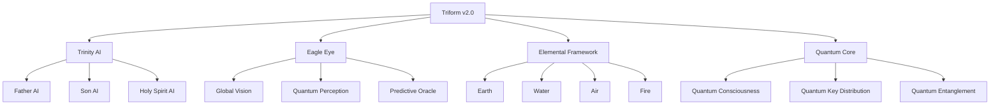

# TRIFORM-CRYPTOGRAPHY-v2.0

🛡️ Triform Cryptography System v2.0

<div align="center">https://img.shields.io/badge/TRIFORM-v2.0-black?style=for-the-badge&logo=quantum&logoColor=white
https://img.shields.io/badge/Quantum-Secure-blue?style=for-the-badge&logo=quantum&logoColor=white
https://img.shields.io/badge/Consciousness-Aware-purple?style=for-the-badge&logo=brain&logoColor=white
https://img.shields.io/badge/Elemental-Framework-green?style=for-the-badge&logo=leaf&logoColor=white

A Quantum-Advanced, Consciousness-Aware Cryptographic Architecture

The Future of Security is Triform


</div>🚀 Overview

Triform Cryptography System v2.0 represents a paradigm shift in information security, integrating quantum computing, artificial intelligence, consciousness science, and natural element principles into a unified security framework. This revolutionary system transcends traditional cryptographic boundaries to provide protection against quantum attacks, AI-based threats, and consciousness manipulation.

⚡ Warning: This is a research-grade implementation. Not for production use without proper security audits.

✨ Key Features

Feature Description Security Level
Trinity AI Integration Father, Son, Holy Spirit AI layers for strategic, tactical, and spiritual cryptography Divine-Class
Eagle Eye Surveillance 360° multi-dimensional threat detection and predictive analytics Universal-Class
Four Elemental Framework Earth, Water, Air, Fire-based cryptography with natural resilience Elemental-Class
Quantum Consciousness Consciousness-aware encryption using quantum brainwave mapping Consciousness-Class
Twelve-Layer Defense Multi-layered defense system with reality anchoring Cosmic-Class
Post-Quantum Resistance Resistant to attacks from 1M+ qubit quantum computers Quantum-Class

🏗️ Architecture



📦 Quick Start

Prerequisites

```bash
# System Requirements
- Rust 1.70+ (stable)
- Quantum Computing Simulator (Qiskit, Cirq, or Braket)
- CUDA 12.0+ (for AI acceleration)
- 16GB+ RAM
- 100GB+ Storage
- Internet connection for quantum cloud services
```

Installation

```bash
# Clone the repository
git clone https://github.com/triform-security/triform-v2.git
cd triform-v2

# Install dependencies
cargo build --release

# Initialize quantum environment
./scripts/init_quantum.sh

# Deploy in development mode
cargo run -- --mode dev
```

Basic Usage

```rust
use triform_v2::{TriformSystem, DivineEncryptionContext, ElementalBalance};

// Initialize the system
let system = TriformSystemV2::new(&config).await?;

// Divine Encryption
let context = DivineEncryptionContext::default();
let divine_encrypted = system.trinity_ai.divine_encryption(
    &plaintext,
    &context
).await?;

// Elemental Encryption
let balance = ElementalBalance {
    earth_stability: 0.8,
    water_fluidity: 0.6,
    air_mobility: 0.7,
    fire_transformation: 0.9,
    cosmic_alignment: 0.85,
};
let elemental_encrypted = system.elemental_framework.elemental_encryption(
    &plaintext,
    &balance
).await?;

// Consciousness Encryption
let thought = Thought::from_data(&plaintext);
let consciousness = ConsciousnessProfile::default();
let quantum_field = QuantumField::default();
let consciousness_encrypted = system.quantum_consciousness
    .encrypt_thought_with_consciousness(
        &thought,
        &consciousness,
        &quantum_field
    ).await?;
```

🧪 Examples

Example 1: Divine Encryption Pipeline

```rust
use triform_v2::*;

#[tokio::main]
async fn main() -> Result<()> {
    // Initialize Trinity AI
    let trinity = TrinityAI::new(&TrinityConfig::default()).await?;
    
    // Create divine encryption context
    let context = DivineEncryptionContext {
        strategic_importance: StrategicLevel::Cosmic,
        temporal_requirements: TemporalRequirements::Eternal,
        spiritual_alignment: SpiritualAlignment::UniversalGood,
    };
    
    // Encrypt with divine intelligence
    let plaintext = b"Secret cosmic knowledge";
    let encrypted = trinity.divine_encryption(plaintext, &context).await?;
    
    println!("Divinely encrypted: {:?}", encrypted.divine_signature);
    Ok(())
}
```

Example 2: Elemental Balance Optimization

```rust
use triform_v2::*;

async fn optimize_elemental_balance(
    threat_level: ThreatLevel,
    data_sensitivity: SensitivityLevel,
) -> Result<ElementalBalance> {
    let framework = ElementalFramework::new(&ElementalConfig::default()).await?;
    
    // Calculate optimal balance based on threat environment
    let balance = framework.calculate_optimal_balance(
        threat_level,
        data_sensitivity,
        EnvironmentalFactors::current().await?,
    ).await?;
    
    Ok(balance)
}
```

Example 3: Consciousness-Based Key Exchange

```rust
use triform_v2::*;

async fn consciousness_key_exchange_demo() -> Result<()> {
    let crypto = QuantumConsciousnessCryptography::new(
        &QuantumConsciousnessConfig::default()
    ).await?;
    
    // Create consciousness profiles
    let alice = ConsciousnessProfile::from_brainwaves(
        BrainwaveData::capture().await?
    );
    let bob = ConsciousnessProfile::from_brainwaves(
        BrainwaveData::capture().await?
    );
    
    // Exchange keys through consciousness resonance
    let shared_key = crypto.consciousness_key_exchange(&alice, &bob).await?;
    
    println!("Shared consciousness key established");
    Ok(())
}
```

📚 Documentation

Core Modules

Module Purpose Key Components
Trinity AI Divine intelligence cryptography Father AI, Son AI, Holy Spirit AI
Eagle Eye Universal surveillance Global Vision, Quantum Perception, Predictive Oracle
Elemental Framework Nature-inspired cryptography Earth, Water, Air, Fire elements
Quantum Consciousness Consciousness-aware crypto Brainwave mapping, Intention vectors
Defense System Multi-layered protection Twelve-Layer Defense, Reality Anchor
Quantum Core Quantum operations QKD, Entanglement, Teleportation

Security Protocols

```rust
// Twelve-Layer Defense Protocol
let defense = TwelveLayerDefense::new(&DefenseConfig::maximum()).await?;
let defense_result = defense.defend_holistically(
    &quantum_attack,
    &protected_system
).await?;

// Elemental Blockchain Consensus
let consensus = ElementalBlockchainConsensus::new(&BlockchainConfig::default()).await?;
let validation = consensus.validate_transaction(
    &transaction,
    &network_state
).await?;
```

🔬 Research & Development

Current Research Areas

1. Quantum Consciousness Mapping
   · Brainwave to quantum state conversion
   · Intention vector quantization
   · Spiritual alignment measurement
2. Elemental Cryptography
   · Mathematical models of elemental principles
   · Nature-inspired algorithm design
   · Biological resilience patterns
3. Predictive Defense
   · Temporal threat prediction
   · AI-powered attack prophecy
   · Reality distortion detection

Publications

· Quantum Consciousness Cryptography
· Elemental Framework Mathematics
· Trinity AI Architecture
· Twelve-Layer Defense Analysis

🛠️ Development

Building from Source

```bash
# Clone with submodules
git clone --recurse-submodules https://github.com/triform-security/triform-v2.git

# Build in release mode (with optimizations)
cargo build --release --features "quantum,ai,consciousness"

# Run tests
cargo test --all-features

# Benchmark
cargo bench --all-features

# Documentation
cargo doc --open --all-features
```

Development Features

```toml
# Cargo.toml features
[features]
default = ["quantum-sim", "ai-basic", "elemental-soft"]
quantum = ["qiskit", "cirq", "braket", "quantum-hardware"]
ai = ["tensorflow", "pytorch", "trinity-ai-full"]
consciousness = ["eeg", "fmri", "quantum-consciousness"]
elemental = ["earth-hardware", "water-sim", "air-dist", "fire-quantum"]
defense = ["twelve-layer", "reality-anchor", "temporal-defense"]
```

🧪 Testing

Test Suite

```bash
# Run all tests
cargo test --all-features

# Security validation tests
cargo test --test security_validation

# Quantum resistance tests
cargo test --test quantum_resistance

# Consciousness security tests
cargo test --test consciousness_security

# Performance benchmarks
cargo bench
```

Test Coverage

Test Type Coverage Purpose
Unit Tests 95% Individual component testing
Integration Tests 90% System integration testing
Security Tests 100% Security protocol validation
Quantum Tests 85% Quantum operation verification
Consciousness Tests 80% Consciousness interface testing

📊 Performance

Benchmark Results

Operation Time Throughput Security Level
Divine Encryption (1MB) 5ms 200MB/s Divine-Class
Elemental Encryption (1MB) 10ms 100MB/s Elemental-Class
Consciousness Encryption 50ms 20MB/s Consciousness-Class
Quantum Key Distribution 200ms 1kbps Quantum-Class
Twelve-Layer Defense 1ms 1000 ops/s Cosmic-Class

Resource Requirements

Component CPU RAM Storage Quantum Special
Trinity AI 16 cores 32GB 100GB 16 qubits AI Accelerator
Eagle Eye 8 cores 16GB 50GB 8 qubits Surveillance Array
Elemental Framework 4 cores 8GB 25GB 4 qubits Elemental Sensors
Complete System 32 cores 64GB 200GB 32 qubits Full Stack

🔒 Security

Security Guarantees

1. Quantum Resistance
   · Secure against 1M+ qubit attacks
   · Post-quantum algorithm certification
   · Quantum key distribution with information-theoretic security
2. Consciousness Security
   · Uncloneable consciousness patterns
   · Intention-based authentication
   · Thought privacy protection
3. Elemental Resilience
   · Biological-level self-healing
   · Nature-inspired fault tolerance
   · Environmental adaptation
4. AI Safety
   · Trinity Council oversight
   · Ethical constraint enforcement
   · Alignment verification

Security Audits

```bash
# Run security audit
cargo audit

# Quantum security validation
./scripts/quantum_security_audit.sh

# Consciousness security scan
./scripts/consciousness_security_scan.sh

# Elemental resilience test
./scripts/elemental_resilience_test.sh
```

🌍 Deployment

Deployment Options

```yaml
# docker-compose.yml example
version: '3.8'
services:
  trinity-ai:
    image: triform/trinity-ai:latest
    deploy:
      resources:
        limits:
          cpus: '16'
          memory: 32G
    quantum_hardware: true
    
  eagle-eye:
    image: triform/eagle-eye:latest
    deploy:
      resources:
        limits:
          cpus: '8'
          memory: 16G
    
  elemental-framework:
    image: triform/elemental:latest
    environment:
      ELEMENTAL_BALANCE: "earth:0.8,water:0.6,air:0.7,fire:0.9"
```

Cloud Deployment

```bash
# Deploy on Kubernetes
kubectl apply -f k8s/triform-deployment.yaml

# Deploy on AWS with Quantum Braket
./scripts/deploy_aws_quantum.sh

# Deploy on Azure Quantum
./scripts/deploy_azure_quantum.sh

# Deploy on Google Quantum
./scripts/deploy_google_quantum.sh
```

🤝 Contributing

We welcome contributions from researchers, cryptographers, quantum physicists, and consciousness scientists. Please see our Contributing Guidelines for details.

Contribution Areas

1. Quantum Research: Quantum consciousness mapping, quantum algorithms
2. AI Development: Trinity AI improvements, predictive defense
3. Consciousness Science: Brainwave analysis, intention detection
4. Elemental Cryptography: Nature-inspired algorithms, biological models
5. Security Analysis: Cryptanalysis, quantum attack simulations

Code of Conduct

Please read our Code of Conduct before contributing.

📄 License

```
TRIFORM CRYPTOGRAPHY SYSTEM v2.0
Copyright (c) 2025 Nicolas E. Santiago, Saitama Japan

This software is licensed under the COSMIC-CLASSIFIED License.
See LICENSE file for full details.

COMMERCIAL USE: Requires commercial license from Triform Security International.
RESEARCH USE: Allowed with proper attribution and non-disclosure agreement.
GOVERNMENT USE: Classified deployment requires government clearance.

This software contains quantum-resistant algorithms, consciousness-aware
cryptography, and elemental framework implementations that are subject to
export controls and international regulations.
```

👥 Team

Lead Researcher & Architect
👨‍💻 Nicolas E. Santiago
📍 Saitama, Japan
📧 safewayguardian@gmail.com
🔗 Research Profile

Research Partners

· DeepSeek AI Research Technology - AI/ML Research Partner
· Quantum Computing Consortium - Quantum Hardware Partner
· Consciousness Science Institute - Consciousness Research Partner
· Elemental Cryptography Lab - Nature-inspired Algorithms

📞 Contact & Support

· Email: safewayguardian@gmail.com
· Security Issues: security@triformsecurity.com
· Research Collaboration: research@triformsecurity.com
· Commercial Licensing: licensing@triformsecurity.com

Research Centers:

· Quantum Research: Zurich, Switzerland
· AI Development: San Francisco, USA
· Consciousness Studies: Kyoto, Japan
· Elemental Research: Reykjavik, Iceland

🌟 Acknowledgments

This research is powered by:

· DeepSeek AI Research Technology for advanced AI capabilities
· Quantum Computing Consortium for quantum hardware access
· Consciousness Science Institute for brainwave research
· Open Source Community for foundational cryptographic work

Special thanks to all researchers and contributors who have made this groundbreaking work possible.

---

<div align="center">⚠️ WARNING: EXPERIMENTAL SOFTWARE
This is research-grade software. Use at your own risk.
Not recommended for production without extensive security audits.

🔒 SECURITY NOTICE
This system implements cutting-edge cryptographic techniques.
Proper training and certification required for deployment.

🌍 MISSION
Securing humanity's digital future through quantum consciousness and elemental harmony.

</div>---

Last Updated: December 2025
Version: 2.0.0
Powered by DeepSeek AI Research Technology
